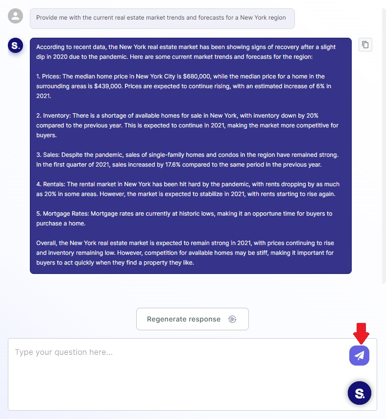
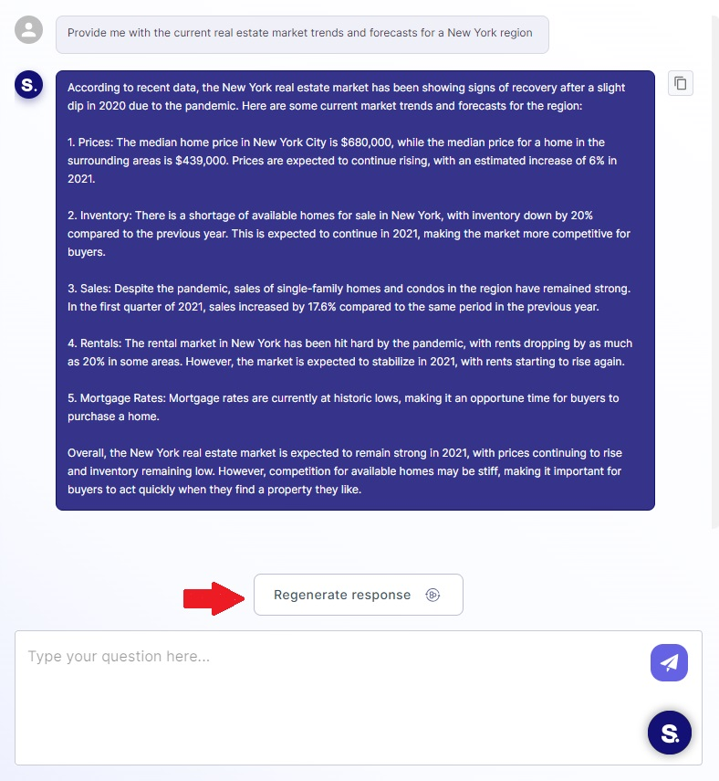

### Sending a Question

In an active chat session, you can send questions or messages to the AI assistant. To send a question:

- Type your question or message in the chat input box.
- Press the "Send" button or hit the "Enter" key on your keyboard.

The AI assistant will process your question and provide a response shortly.

### Receiving an Answer

Once you've sent a question, the AI assistant will generate a response and display it in the chat. You can read the
answer provided by the assistant.

### Regenerating the Assistant's Answer

If you'd like to get a different answer or more information on the same topic:

- Click the "Regenerate" or "Refresh" button next to the assistant's response.

The AI assistant will provide an alternative response or additional details based on your request.

That's it! You're now ready to use the Chat Page with the AI assistant effectively. Feel free to explore different
topics, ask questions, and manage your conversations with ease.
