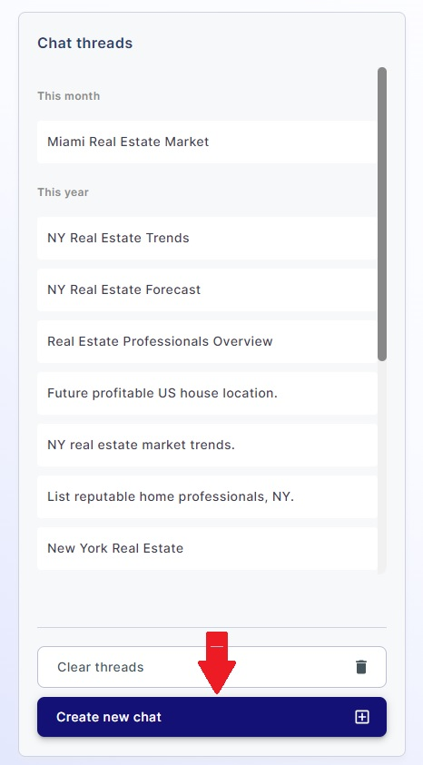
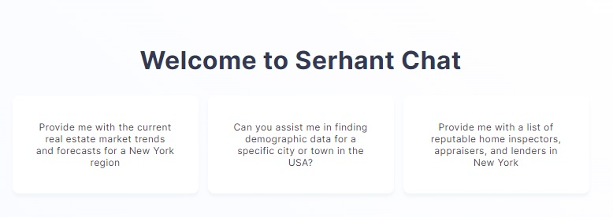

### Starting a New Chat

To start a new chat with the AI assistant:

- Click the "Create new chat" button in the left menu where is your chat list.

This action will create a new chat session with the AI assistant, allowing you to ask questions and receive responses.

### Choosing from Suggestions

On the initial empty page, you'll find a list of suggestions to help you begin your conversation. Each suggestion is a
predefined question or topic. To start a new chat based on a suggestion:

- Click on one of the suggestions that interests you.

By clicking on a suggestion, a new chat session will be initiated with the suggestion's text.

