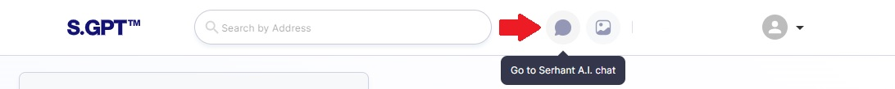
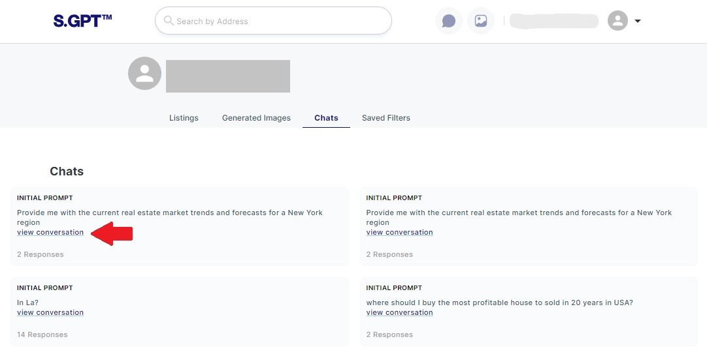
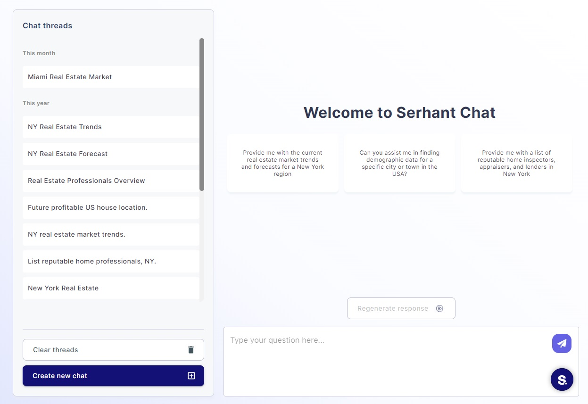

### Accessing the Chat Page

To access the Chat Page with the AI Assistant, follow these steps:

- Log in to your account.
- Navigate to the "Chat" page clicking on the chat icon in the header tab.

- Navigate to the "Chat" page from Profile Chats page by clicking on "View conversation".

### Initial Empty Page

Upon accessing the Chat Page for the first time, you will be greeted with an empty chat interface. Here, you can see a
welcoming message and a set of suggestions to help you get started with your conversation.

Here is a short list of structure:

- Chat threads list where you can find all your chats and action buttons
- Welcoming page with suggestion how to start your chat
- Input area where you can write a question and send it with Regenerate response button

