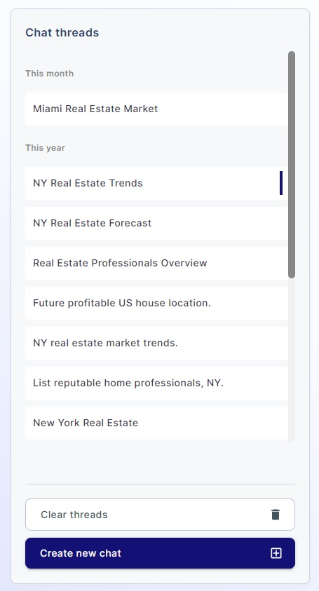

### Chat List

On the Chat Page, you will see a list of your ongoing and past chat sessions. Each chat will be displayed with a name
that was automatically generated based on your first question to help you recognize it.

### Navigating Chats

To navigate through your chats:

- Click on the chat title in the chat list.

You can easily identify currently active chat with blue vertical line on the right side of the chat item.

This will open the selected chat, allowing you to continue the conversation or review previous interactions.

### Deleting all chats

You can delete all your chats by clicking on `Clear threads` button. This action is irreversible, so you need to be sure
you won`t need a chat from deleted list
