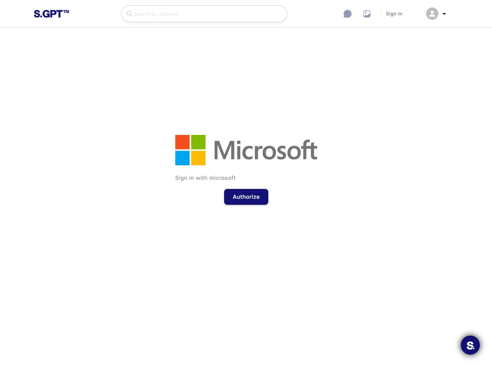

# Authorization

This guide will walk you through the process of authorizing and logging in to a corporate web application that uses
Microsoft Popup Authorization. This method involves initiating the login process in a popup window. Let's get started!

## 1. Accessing the Corporate Web Application

### 1.1. Navigating to the Login Page

To access the corporate web application and initiate the login process:

1. Open your web browser.
2. Enter the `serhant.com` URL in the address bar.
3. Press "Enter" or click "Go" to navigate to the web application's login page.

## 2. Initiating the Login Process

### 2.1. Clicking the "Authorize" Button

When you are first time in Serhant GPT, you will be automatically redirected to login page.

Upon reaching the web application's login page, you will likely encounter a page with a single button labeled "
Authorize." This button is the entry point for initiating the login process.

To begin the login process:

1. Click on the "Authorize" button.

This action will trigger the Microsoft Popup Authorization process.

## 3. Microsoft Popup Authorization

### 3.1. Popup Window Appearance

After clicking the "Authorize" button, a popup window will appear on your screen. This window is where you will complete
the login process using your Serhant Microsoft account credentials.

### 3.2. Sign-in with Microsoft Account

In the popup window:

1. You will be prompted to sign in with your Microsoft account credentials.
2. Enter your email address and password associated with your Microsoft account.
3. Click the "Sign In" button.

### 3.3. Granting Permissions

Once you've signed in, you may be asked to grant permissions to the web application. These permissions might include
access to your Microsoft account information or other required permissions.

Review the permissions request carefully to ensure you are comfortable with them. To grant permissions:

1. Review the permissions request.
2. Click the "Accept" or "Allow" button to grant the necessary permissions.

### 3.4. Returning to the Web Application

After granting permissions, you will be redirected back to the Serhant GPT. You should now have access to
the application's features and content.

You have successfully authorized and logged in to the corporate web application using Microsoft Popup Authorization.
