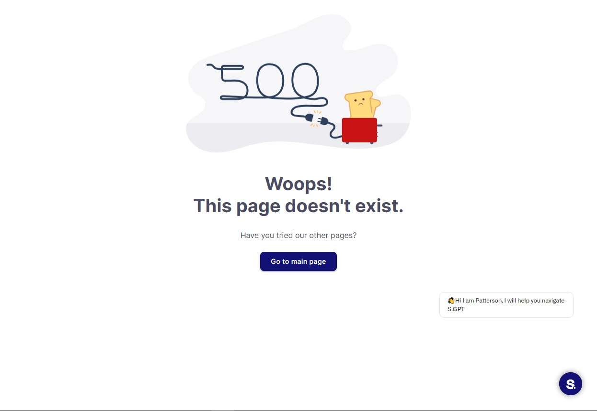
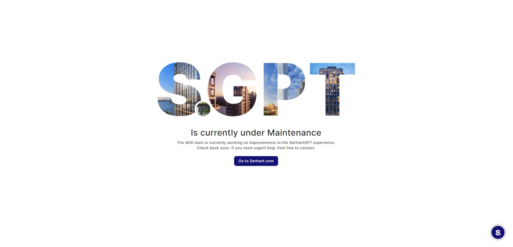

# Handling Errors on the Web Application

This guide will help you understand how to handle errors that may occur while using the web application. Errors can
disrupt your experience, but you can often resolve them or take appropriate actions to continue using the application.

## 1. Recognizing Error Pages

### 1.1. Identifying Error Messages

Error pages typically display a message that indicates what went wrong. Common error messages include `Page Not
Found` and `Server Error` or `Under Maintaince` in our case. These messages help you understand the nature of the
problem.

#### Not found page

Not found page means you have reached page that does not exist, to fix this error you just need to go back or going to
main page clicking on `Go to main page` button.

#### App error/ Under maintenance

This error is more serious, you can try fix it by reloading page. If you have such errors, we are sorry for that
experience, and we will fix it as soon as possible.

## 2. Handling Common Errors

### 2.1. Refresh the Page

Sometimes, errors are temporary and can be resolved by refreshing the page:

1. Click the refresh icon in your browser or press the F5 key on your keyboard.
2. Wait for the page to reload.

If the error was due to a temporary glitch, this may resolve the issue.

### 2.2. Check Your Internet Connection

A stable internet connection is essential for using web applications. If you encounter an error, check your internet
connection:

1. Ensure you are connected to the internet.
2. If you are on a Wi-Fi network, make sure it's functioning correctly.
3. If you are on a mobile network, ensure you have a strong signal.

### 2.3. Clear Browser Cache and Cookies

Stale browser data can sometimes cause issues. Clearing your browser's cache and cookies can help:

1. Access your browser's settings or preferences.
2. Find the option to clear cache and cookies.
3. Select this option and confirm to clear the data.
4. Close and reopen your browser.

## 3. Navigating Back to the Application

### 3.1. Using the Browser Back Button

If you find yourself on an error page, and you want to return to the previous screen within the application:

1. Locate the back button in your browser (usually an arrow pointing left).
2. Click the back button to navigate to the previous page.

### 3.2. Clicking on the Application Logo

Many web applications have their logo or home button in the header. Clicking on the application's logo or home button
often takes you back to the main page of the application.

### 3.3. Re-entering the Application URL

If you're unable to navigate back using the browser's navigation buttons or the application's logo, you can manually
re-enter the URL of the application in the address bar and press "Enter" to reload the main page.

By following these steps, you can effectively handle common errors that may occur while using the web application and
continue enjoying its features. If the issue persists or if you encounter specific error messages, don't hesitate to
reach out to the application's support team for assistance.