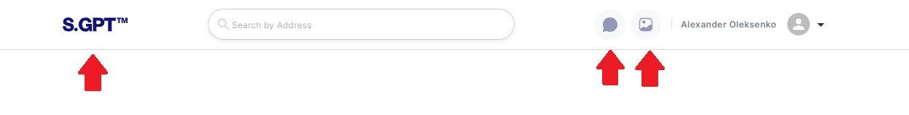
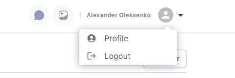
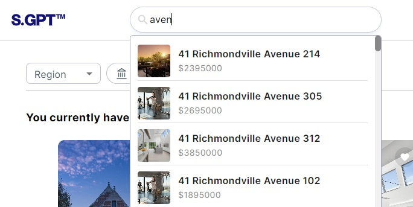

# Header Functionality

The header serves as a central hub for various actions, including navigation, profile management, and
searching listings. This guide will cover these functionalities in detail.

## Table of Contents

1. **Navigation**
    - 1.1. Logo Navigation
    - 1.2. Quick Access Icons

2. **Profile Management**
    - 2.1. User Avatar and Name
    - 2.2. Profile Menu
    - 2.3. Profile Page

3. **Searching Listings**
    - 3.1. Search Input
    - 3.2. Search Results

### 1. Navigation

#### 1.1. Logo Navigation

In your web application's header, you'll find the logo, typically located at the top-left corner. The logo serves as a
home button, allowing you to easily return to the main/home page of the application.

- **Clicking on the Logo:** To navigate to the main/home page at any time, simply click on the application's logo.

#### 1.2. Quick Access Icons

Adjacent to the logo, you'll find two icon buttons. Each of these icons provides quick access to specific pages within
your application:

- **Message Icon:** Clicking on this icon will take you to the Chat page, where you can engage in conversations with the
  AI assistant or other users.

- **Image Gallery Icon:** Clicking on this icon will navigate you to the Editing Images page, where you can edit and
  manage images as needed.

### 2. Profile Management

#### 2.1. User Avatar and Name

In the header, you'll notice a user profile block that includes your avatar (profile picture) and your name, making it
easy to identify your account.

- **Clicking on the User Avatar and Name:** Clicking on your avatar or name will open the profile menu, providing access
  to profile-related actions.

#### 2.2. Profile Menu

The profile menu is a dropdown menu that appears when you click on your user avatar or name in the header. It contains
options for managing your user account:

- **Logout Button:** Clicking on the "Logout" button will log you out of your account, ending your current session
  securely.

- **Profile Menu Item:** Clicking on the "Profile" menu item will navigate you to the Profile page, where you can view
  and edit your account information.

#### 2.3. Profile Page

To access this page, simply click on the "Profile" menu item in
the profile dropdown.

### 3. Searching Listings

#### 3.1. Search Input

The header also features a search input box that allows you to search for listings within the application
easily.

- **Entering a Search Query:** Type the keyword or phrase you want to search for in the search input box.

#### 3.2. Search Results

As you type in your search query, the application will display real-time search results below the search bar. These
results typically include listing items with essential information, such as titles, descriptions, or images.

- **Clicking on a Search Result:** To view more details about a specific listing, click on the corresponding search
  result. This action will redirect you to the Listing Item page.

By following the instructions in this user guide, you'll be able to efficiently navigate, manage your profile, and
search for listings within your web application's header.