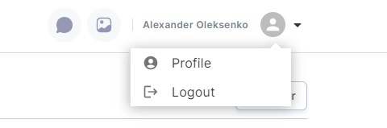

# Navigating Pages

This comprehensive user guide will help you navigate seamlessly through the various pages and features of your web
application. Whether you're exploring listings, creating content, editing images, chatting, logging in, or managing your
profile, this guide will ensure you can easily access and use each page effectively.

## Table of Contents

1. **Main Page**
    - 1.1. Finding Listings
    - 1.2. Filtering Listings
    - 1.3. Navigating to Listing Item Page
    - 1.4. Creating Content

2. **Create Content Page**
    - 2.1. Open "Add Listings" Modal
    - 2.2. Navigating to Listing Item Page

3. **Editing the Image Page**
    - 3.1. No Navigation Items

4. **Chat Page**
    - 4.1. Navigating Between Chat Threads

5. **Login Page**
    - 5.1. Page for Unauthorized Users

6. **Profile Page**
    - 6.1. Listings Subpage
    - 6.2. Generated Images Subpage
    - 6.3. Chats Subpage

[//]: # (    - 6.4. Saved Presets Subpage)

7. **Header navigation**

### 1. Main Page

#### 1.1. Finding Listings

On the Main Page, you can discover listings relevant to your interests. Browse through the listings to find the content
you need.

#### 1.2. Filtering Listings

To refine your search, use the available filters to sort and organize listings based on criteria such as category, date,
or location.

#### 1.3. Navigating to Listing Item Page

- **Click on an Image:** If you want more details about a specific listing, click on the image associated with that
  listing. This action will take you to the Listing Item Page, where you can access comprehensive information.

#### 1.4. Creating Content

- **Create Content Button:** Click on the "Create Content" button. You'll be redirected to the Create Content Page.

### 2. Create Content Page

#### 2.1. Open "Add Listings" Modal

On the Create Content Page, you can open the "Add Listings" modal to select and add listings to your chosen listings and
create content for them.

#### 2.2. Navigating to Listing Item Page

- **Click on an Image:** Just like on the Main Page, if you click on the image of a specific listing, you'll navigate to
  the Listing Item Page for detailed information.

### 3. Editing the Image Page

On the Editing Image Page, there are no specific navigation items. This page is primarily for editing and managing
images.

### 4. Chat Page

#### 4.1. Navigating Between Chat Threads

On the Chat Page, you can navigate between your chat threads in the left panel. Click on a chat thread to view the
entire conversation with the selected user.

### 5. Login Page

The Login Page is exclusively for unauthorized users. If you log out while using the application, you will be
automatically redirected to this page. Unauthorized users cannot navigate to other pages except this one.

### 6. Profile Page

The Profile Page offers several subpages, each serving specific purposes:

#### 6.1. Listings Subpage

Here, you can view listings you've liked. Clicking on the image of a listing will navigate you to the Listing Item Page,
where you can get more information about the listing.

#### 6.2. Generated Images Subpage

This subpage allows you to see all the images you've generated.

#### 6.3. Chats Subpage

In the Chats subpage, you can see all your chat conversations. Clicking the "View Conversation" button for a specific
chat item will navigate you to the Chat Page, where you can review the entire chat.

[//]: # (#### 6.4. Saved Presets Subpage)

[//]: # ()
[//]: # (Here, you can access your saved presets for generating images. When you click on the "Apply" icon button of a saved)

[//]: # (preset item, you will be navigated to the Editing Image Page.)

[//]: # ()
[//]: # (![profilePageImagesSavedPresets]&#40;../../static/common/profilePageImagesSavedPresets.jpg&#41;)

### 7. Listing item page

This page does not have any navigation items or features.

### 8. Header Navigation

In the header section, you'll find additional navigation functionality:

- **Logo:** Clicking on the application's logo will take you to the main/home page.
- **Message Icon:** Clicking on this icon will navigate you to the Chat Page.
- **Image Gallery Icon:** Clicking on this icon will take you to the Editing Image Page.
- **Profile Block:** Clicking on your user avatar or name will open the profile menu, where you can access various
  profile-related actions, including navigating to the Profile Page.

By following the instructions in this user guide, you'll be able to navigate smoothly through all the pages and features
of your web application, ensuring an efficient and enjoyable user experience.