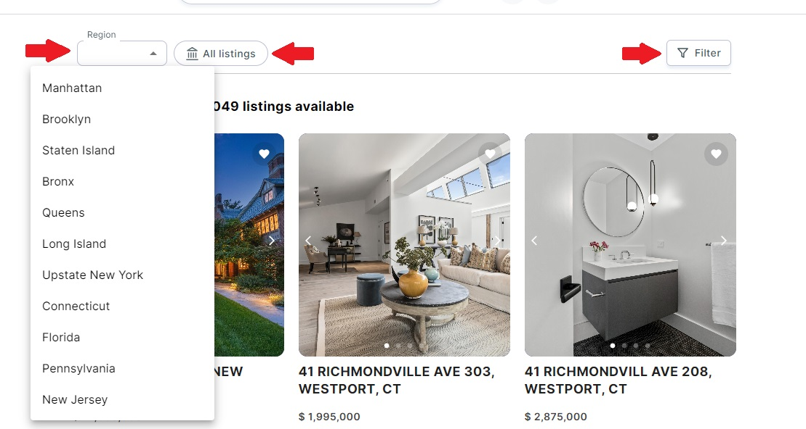
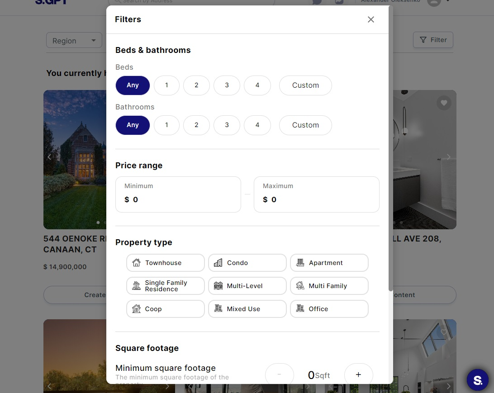
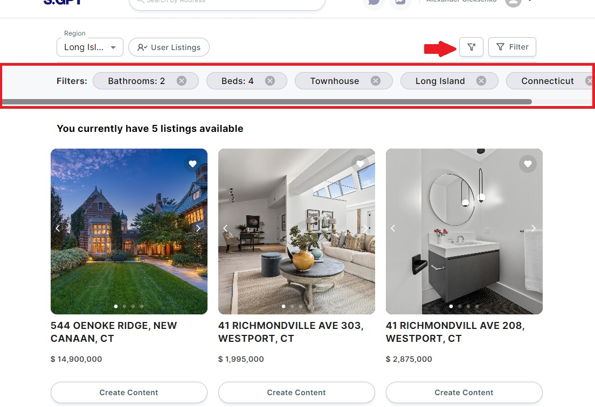

# Searching listings

This comprehensive user guide will help you efficiently find the necessary listings within your web application using
various search and filtering options available.

## Table of Contents

1. **Searching Listings in the Header**
    - 1.1. Using the Search Input
    - 1.2. Viewing Search Results
    - 1.3. Navigating to a Listing Item Page

2. **Filtering Listings on the Main Page**
    - 2.1. Filtering by Region
    - 2.2. Toggling "All Listings" and "User Listings"
    - 2.3. Using the Filter Button
    - 2.4. Resetting Filters

### 1. Searching Listings in the Header

#### 1.1. Using the Search Input

In the header of your web application, you'll find a search input field where you can quickly search for listings based
on keywords or phrases.

- **Enter Your Search Query:** Type what you want to find in the search input field.

#### 1.2. Viewing Search Results

As you type in your search query, the application will display real-time search results directly below the search bar.
These results include listings with essential information, such as titles, descriptions, or images.

#### 1.3. Navigating to a Listing Item Page

- **Click on a Search Result:** To view more details about a specific listing, click on the corresponding search result.
  This action will redirect you to the Listing Item Page, where you can access comprehensive information about the
  listing.

### 2. Filtering Listings on the Main Page

The Main Page provides various options to filter and refine the listings displayed.

#### 2.1. Filtering by Region

On the Main Page, you'll find multiple-select fields for regions. You can use these fields to filter listings by
specific regions.

- **Select Region(s):** Click on the region(s) you want to filter by. You can choose one or multiple regions.

#### 2.2. Toggling "All Listings" and "User Listings"

There is a toggle button labeled "All Listings" or "User Listings" on the Main Page. This button allows you to switch
between viewing all available listings or only the listings associated with your user account.

- **Toggle Button:** Click the "All Listings" or "User Listings" button to switch between the two options.

#### 2.3. Using the Filter Button

If you need more specific filtering options, click the "Filter" button on the Main Page. This action will open a Filter
modal where you can apply additional filters to narrow down the listings based on your preferences.

- **Open the Filter Modal:** Click the "Filter" button.

#### 2.4. Resetting Filters

If you have applied filters and want to clear them all to view all listings again, look for the "Reset Filters" icon
button, typically visible when filters are active.

- **Reset Filters:** Click the "Reset Filters" icon button to clear all applied filters and return to the default view.

By following the instructions in this user guide, you can effectively find the necessary listings within your web
application using the search and filtering options available.