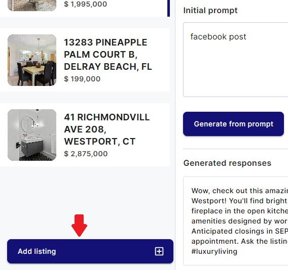

# Choosing Listings

Selecting new listings for content creation is essential. Here's how to do it:

1. **Viewing Existing Chosen Listings:**
    - Start by accessing the Creating Content page.
    - On this page, you'll see the section displaying your existing chosen listings.

2. **Adding a New Listing:**
    - To add a new listing for content creation, locate the "Add Listing" button below your existing chosen listings.
    - Click the "Add Listing" button to initiate the process.

3. **Choose from Main Page**
   In the main page you can see listings, if you click on a certain listing `Create content` button - you will be
   redirected to the Create content page and this listings will be chosen to be active. So, you can create content for
   this item.

4.**Viewing All Available Listings:**

- After clicking the "Add Listing" button, you'll be directed to a modal that displays all available
  listings that are suitable with filters if there are such.

5.**Choosing a Listing to Create Content For:**

- Browse through the list of available listings.
- Select the listing you want to create content for by clicking on the "Create Content" button associated with that
  listing.

**Managing Chosen Listings:**

- Keep in mind that you can have a maximum of 5 chosen listings at any given time.
- If you already have 5 chosen listings and select a new one, the oldest listing among your selections will be
  automatically replaced.

By following these steps, you can effectively choose new listings for content creation in your web application, ensuring
that you have the most relevant listings available for your content generation needs.