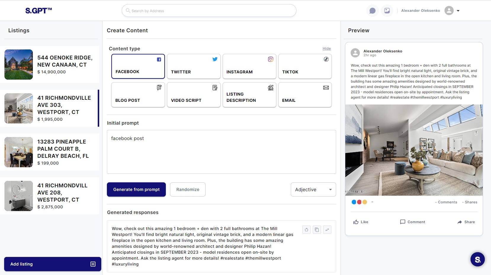
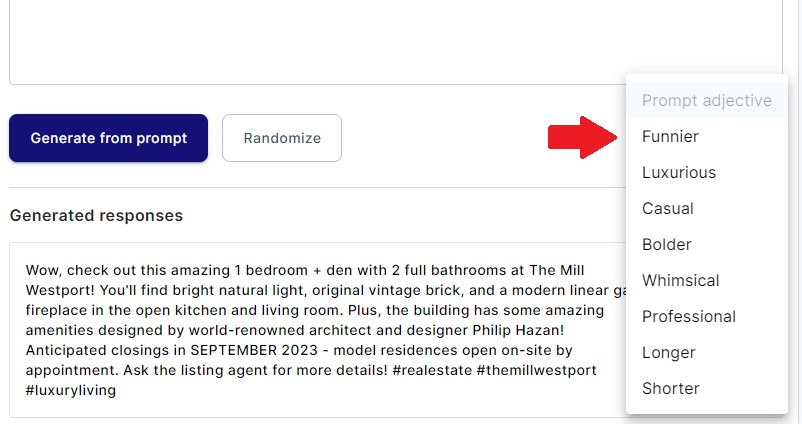
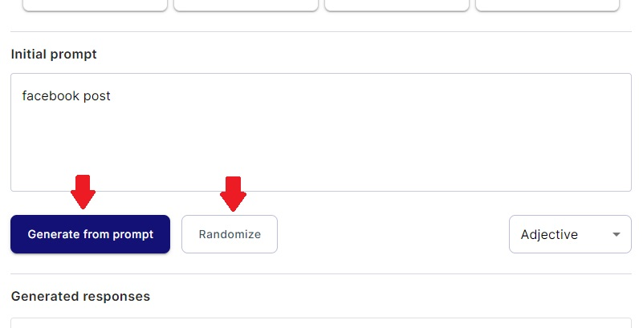
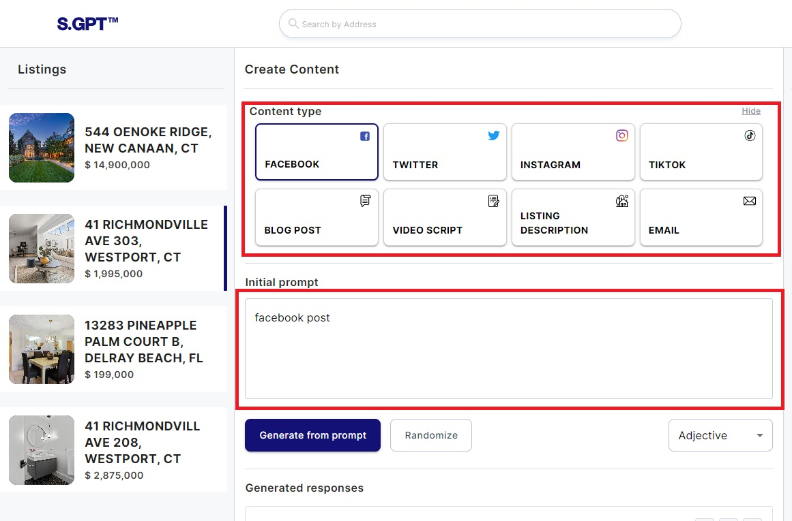

# Generating Content

Generating content in Serhant GPT is a versatile process that allows you to customize content based on content
type, style, and prompts. This guide provides detailed instructions on how to generate content effectively using these
functionalities.

### 1. Accessing the Create Content Section

Before you can generate content, you need to access the Create Content section of your web application. Here's how to
get there:

#### 1.1. Navigating to the Create Content Section

- Log in to your user account on the web application.
- Navigate to the Creating Content page or a related page that provides content generation options.

### 2. Choosing Content Type

Customizing the content type is the first step in generating content. Content type influences the style of your
resulting content. Here's how to do it:

#### 2.1. Selecting Content Type

- In the Create Content section, locate the "Content Type" option.
- Depending on your device (mobile or desktop), you will either see a select menu or clickable cards.
- Click on the content type you desire. This selection will impact the style of your content.

### 3. Selecting Adjectives for Text Style

To add style to your generated content, you can choose adjectives. Here's how to do it:

#### 3.1. Choosing Adjectives

- In the Create Content section, find the "Adjective" select menu.
- Use the select menu to choose the adjectives that best fit your desired style.

### 4. Generating Content

Now that you've customized your content type and selected adjectives, it's time to generate content. There are two
primary ways to do this:

#### 4.1. Using the "Generate from Prompt" Button

- Ensure you've set your content type, selected adjectives, and provided any additional instructions in the "Initial
  Prompt" field.
- Click the "Generate from Prompt" button.
- The system will create content using all the data you've entered, including the content type, adjectives, and initial
  prompt.

#### 4.2. Using the "Randomize" Button

- Just like in the "Generate from Prompt" method, ensure you've set your content type, selected adjectives, and provided
  an initial prompt (if desired).
- Click the "Randomize" button.
- The system will use your chosen values for content creation but randomly add some adjectives for additional variation.

#### 4.3. Writing a Prompt in the Input Box

- In the Create Content section, locate the "Initial Prompt" input box.
- Write a precise prompt or additional instructions regarding the content you want to generate.
- Combine this with your chosen content type and adjectives to provide detailed guidance to the content generation
  process.

By following these instructions, you can effectively generate content in your web application, taking advantage of
content type selection, adjectives for style, and the flexibility of prompts. Whether you want to create specific
content or experiment with various styles, these functionalities provide you with the tools to tailor your generated
content to your needs.