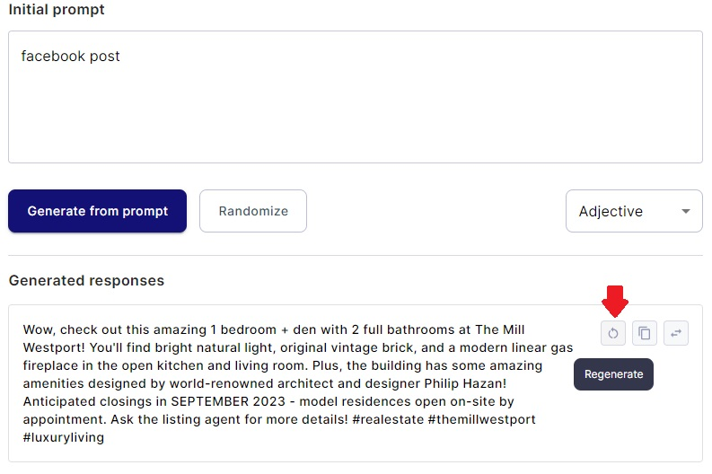

# Managing Generated Responses

In Serhant GPT, the ability to regenerate content and manage your generated responses is a valuable feature.
This guide focuses on the actions users can perform in the Generated Responses section on the Create content page.

### 1. Viewing Generated Content

Once you're on the Create content page, you can view the content you've previously generated. Here's how:

#### 1.1. Locating Generated Responses

- Beneath the "Generated Responses" label, you'll find a list of the content you've created for specific listings. This
  content includes text or other generated items.

### 2. Regenerating Content

Regenerating content allows you to create new variations of your generated responses while keeping the same input
parameters. Here's how:

#### 2.1. The "Regenerate" Button

- For each piece of generated content, you'll see a "Regenerate" icon button associated with it.
- Click the "Regenerate" button for the specific response you want to recreate.
- The system will use the same inputs you initially provided to generate new content.

### 3. Copying Content

Copying content allows you to easily duplicate generated responses for various purposes. Here's how:

#### 3.1. The "Copy" Button

- For each piece of generated content, you'll see a "Copy" button associated with it.
- Click the "Copy" button to copy the content to your clipboard.
- You can then paste the copied content wherever needed, such as in documents, emails, or other applications.

### 4. Selecting Generated Content

You can select specific generated content for further action or preview. Here's how:

#### 4.1. The "Choose this generated content" Button

- For each generated response, you'll see a "Choose this generated content" button.
- Click the "Choose this generated content" button to select the response.
- The selected content will typically be displayed in a preview or active section, allowing you to use or interact with
  it further.

By following these instructions, you can effectively regenerate content and manage your generated responses within your
web application.