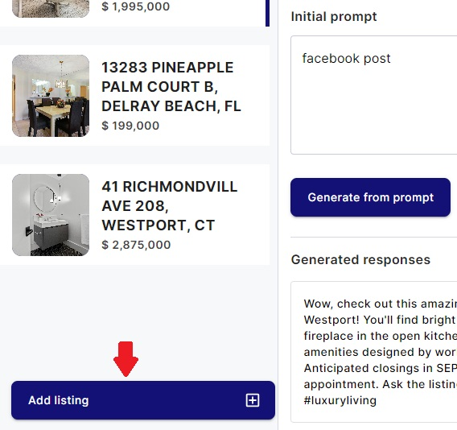
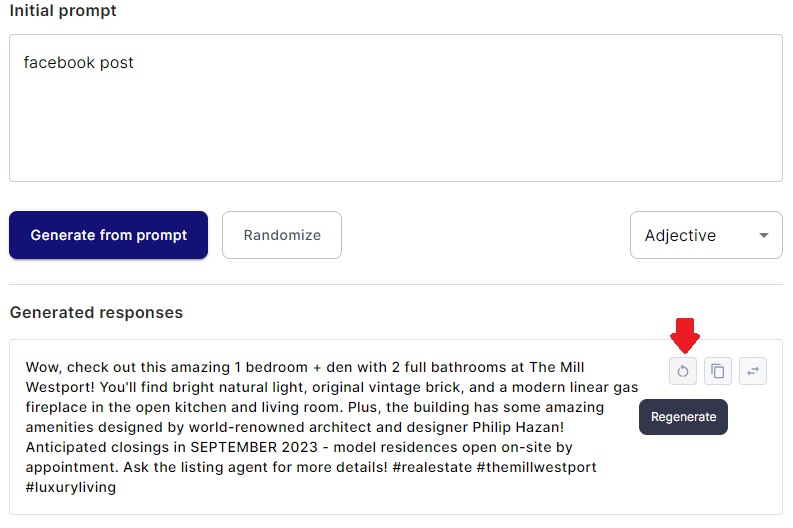
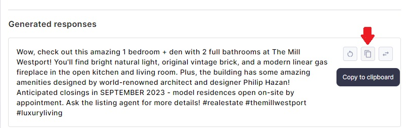
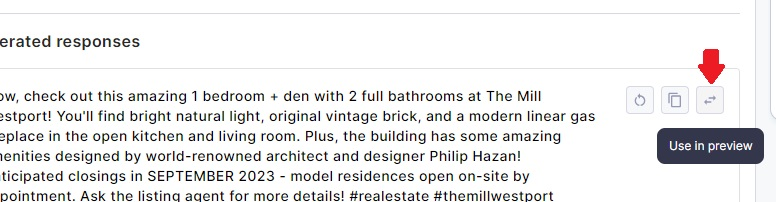
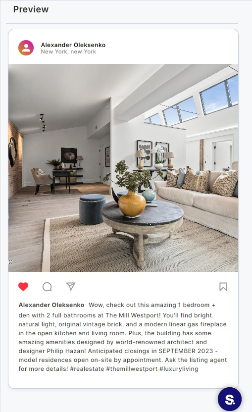

# Creating Content Page

Welcome to the Creating Content page of your web application. This page is designed to help you create content for
chosen listings, making it a valuable tool for content creation. The page is divided into three main sections: Listings,
Create Content, and Generated Responses. In this user guide, we will explore the functionalities of each section in
detail.

## Table of Contents

1. **[Listings Section](#1-listings-section)**
    - 1.1. Viewing Chosen Listings
    - 1.2. Adding a New Listing
    - 1.3. Hiding the Listings Section (Mobile)

2. **[Create Content Section](#2-create-content-section)**
    - 2.1. Selecting Content Type
    - 2.2. Inputting Initial Prompt
    - 2.3. Choosing Adjective Style
    - 2.4. Content Generation Options

3. **[Generated Responses Section](#3-generated-responses-section)**
    - 3.1. Viewing Generated Content
    - 3.2. Managing Generated Content

4. **[Preview section](#4-preview-section)**

### 1. Listings Section

#### 1.1. Viewing Chosen Listings

The Listings section displays the listings you have chosen for content creation. Each listing is represented here, and
you can easily manage them.

#### 1.2. Adding a New Listing

To add a new listing to the selection:

- Click the "Add Listing" button. This will display all available listings, and you can choose one by clicking on the "
  Create Content" button of a specific listing.

Please note that you can have a maximum of 5 chosen listings. When you select a new one, the oldest listing is
automatically removed.

#### 1.3. Hiding the Listings Section (Mobile)

If you are using a mobile device and want to hide the Listings section to free up screen space:

- Click the "Hide" button near the "Listing" label.

### 2. Create Content Section

The Create Content section is where you configure and generate content for your chosen listings.

#### 2.1. Selecting Content Type

Choose the content type, which influences the style of your resulting content. Depending on your device (mobile or
desktop), you can select from a dropdown menu or click on cards to make your selection.

#### 2.2. Inputting Initial Prompt

In the "Initial Prompt" field, you can provide specific instructions or details about the content you want to generate.

#### 2.3. Choosing Adjective Style

Use the "Adjective" select menu to pick a style for the created content.

#### 2.4. Content Generation Options

You have two options for generating content:

- **Generate from Prompt:** Click this button to create content using all the data you've entered.

- **Randomize:** Clicking this button will use your chosen values for content creation but randomly add some adjectives
  to the content.

### 3. Generated Responses Section

The Generated Responses section displays the content you have created for certain listings.

#### 3.1. Viewing Generated Content

- Under the "Generated Responses" label, you can find all the content you have created. Note that generated responses
  are not shown on mobile devices.

#### 3.2. Managing Generated Content

Each created text has a few buttons for managing your content:

- **"Regenerate" Button:** Clicking this button will generate new content using the same inputs you used for creating
  this text.

- **"Copy" Button:** Clicking this button will copy the text to your clipboard for easy sharing or pasting.

- **"Choose this generated content" Button:** By clicking this button, you can view the selected content in the Preview
  section.

### 4. Preview Section

Here you can see how the content you generated will look like in different social medias.

To change preview just choose necessary option in the content type box, where you can see all preview options.

By following these instructions, you can effectively use the Creating Content page to select
listings, configure content creation settings, regenerate content, and manage your generated responses.