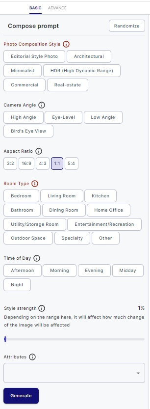

# Filters for generation

In this guide, we will explore how to set both advanced and basic filters on the Editing images page of Serhant GPT.
We'll also discuss the significance of the `Prompt` field in advanced filters and mention some
drawbacks associated with using filters.

## Setting Advanced Filters

Advanced filters provide a high level of customization for image generation. To access and utilize advanced filters,
follow these steps:

1. **Accessing Advanced Filters:**

    - On the Editing images page, look for the "Advance" filter option on the left side of the Filters section.

2. **Understanding Advanced Filter Fields:**

    - Within the "Advance" filter, you will find various select menus and a prompt field. Each of these fields serves a
      specific purpose in customizing the image generation process.

    - Hover your mouse cursor over the "Info" icon near the field's label to gain a better understanding of its
      function. This information will help you make informed choices when configuring advanced filters.

3. **Importance of the `Prompt` Field:**

    - Among the advanced filter fields, the `Prompt` field is of utmost importance. It significantly impacts
      which image will be generated.

    - The `Prompt` field allows you to provide specific guidance to the AI regarding the content, style, or
      theme you want for the generated image.

    - It's obligatory to write in the `Prompt` field when using advanced filter options. This input helps the
      AI understand your creative intent and produce more relevant results.

## Setting Basic Filters

Basic filters are designed for quick enhancements to your images. To set basic filters, follow these simplified steps:

1. **Accessing Basic Filters:**

    - On the Editing images page, you will typically see basic filter options displayed alongside your image in the
      Filters section.

2. **Applying Basic Filters:**

    - To apply a basic filter, simply click on the `BASIC` option representing the filter.

    - Basic filters provide predefined adjustments and enhancements to your image, making it easy to achieve quick
      results.

There are three main ways of configuration:
- option cards where you choose one option.
- multi-select field where are many different filters for generating very precise images.
- slider for choosing how much your image will be changed

Pay attention that `Photo Composition Style` field and `Room Type` are obligatory, so you always need to choose them.
If you leave them empty, you will see errors and red label.

- 

## Drawbacks to Consider

While filters can greatly enhance your images, there are some drawbacks to be aware of:

1. **Loss of Originality:**

    - Applying too many filters or extreme adjustments can result in a loss of the originality and authenticity of your
      image.

2. **Over-Processing:**

    - Over-processing an image with multiple filters can lead to a loss of detail and quality, making the image appear
      unnatural.

3. **Resource Intensive:**

    - Applying advanced filters and generating images can be resource-intensive and may take time, especially during
      periods of high demand.

By understanding the options and limitations of both advanced and basic filters, you can make informed decisions when
enhancing and customizing your images on the Editing images page of Serhant GPT.