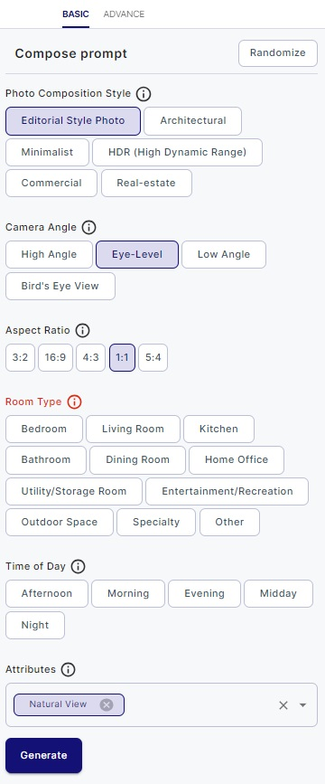

# Generating Images

Generating images on the Editing the Image Page allows you to create captivating visuals using various filters and
settings. This guide will walk you through the process step by step.

### 1. Accessing the Editing the Image Page

- Start by logging in to your user account on the web application.

- Navigate to the Editing the Image Page using the provided link or menu option.

### 2. Choose an Image

Before generating images, ensure that you have selected or uploaded an image to work with. If you haven't done this,
follow the steps in the "Uploading an Image" section of the user guide.

To choose an image from suggestion, just click on it.

### 3. Applying Filters

#### 3.1. Basic Filters

- In the Filters section, you'll find basic and advanced filter options. Start with basic filters if you're new to the
  process.

#### 3.2. Advanced Filters

- For more customization, choose the "Advance" filter on the left. Here, you'll see various select menus and prompt
  field which is the most important here and it`s required, because it significantly impacts on which image will be generated.

- Each field serves a specific purpose. Hover over the "Info" icon near the field's label to understand its function.

### 4. Start generation

- Once you've chosen the necessary fields, click the "Generate" button.
- Or you also can press `Randomize` button that will randomly choose all filters and start image generation.

The image generation process will start, and you'll be able to monitor the progress.

### 5. Viewing Generated Images

- After the new images have been generated, they will appear in the Preview section.

- Depending on the type of generation, you may see multiple generated images. Use the arrow buttons in the main chosen
  image or click on the images in the bottom part of the Preview section to switch between them.

  
In top right corner you can see an image which was used to create new images for you, if you click on it, you will see full screen preview of this image.

### 6. Patience During Generation

Generating new images can take some time, depending on the load on the generation AI. Please be patient and allow the
system to complete the process.

If you encounter any issues during the image generation process, consider reloading the page. Pay attention to error
messages displayed at the top right and follow any provided directions.

By following these steps, you can successfully generate images on the Editing images page of Serhant GPT.
Experiment with different filters and settings to create captivating visuals that meet your creative needs.