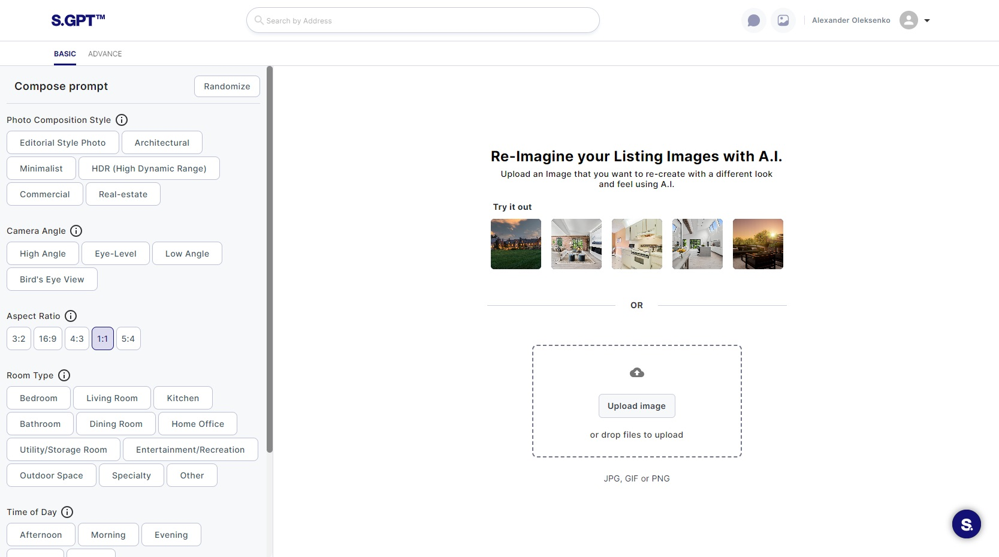
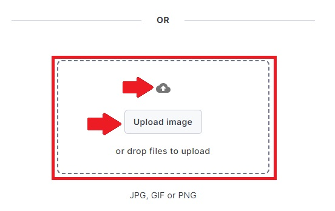
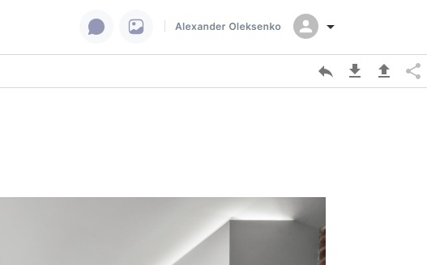
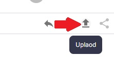
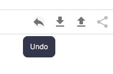

# Uploading and Deleting Images

This guide provides detailed instructions on how to upload an image and subsequently delete it if needed on the Editing
the Image Page of your web application.

### 1. Uploading an Image

Before you can edit or enhance an image, you'll need to upload it to the Editing the Image Page. Here's how to do it:

#### 1.1. Accessing the Editing the Image Page

- Log in to your user account on Serhant GPT.
- Navigate to the Editing the Image Page, typically via the header navigation.

#### 1.2. Choosing to Upload an Image

- On the Editing the Image Page, look for the option to upload an image. This can be found as a button labeled "
  Upload image".

#### 1.3. Drag-and-Drop Upload

- You can upload an image by clicking on the "Upload Image" button, which may open a file dialog.
- Alternatively, it`s allow for drag-and-drop functionality. In this case, you can simply drag your
  image file from your computer and drop it into the designated area on the page.

#### 1.4. Uploading through the image actions

- When you have chosen an image, you can see the image actions for managing an image more effective.

Here is an `Upload` icon button, you can click it to upload a new image.

#### 1.5. Successful Image Upload

- Once you've chosen or uploaded an image, you'll typically see the selected image displayed in the Preview section of
  the page. This confirms a successful image upload.

### 2. Deleting an Image

If you need to remove an uploaded image for any reason, you can follow these steps:

- Find `Undo` icon button in the top right corner where are other buttons for managing a chosen image.
- Click on this icon button, after that an image should be deleted from your screen.

By following these detailed instructions, you can successfully upload an image to the Editing images page and, if
needed, delete it. These steps ensure that you can manage your images efficiently within Serhant GPT.