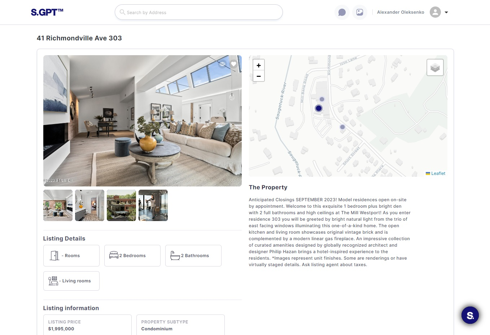
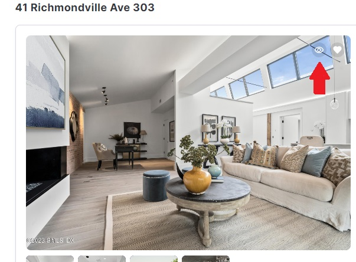
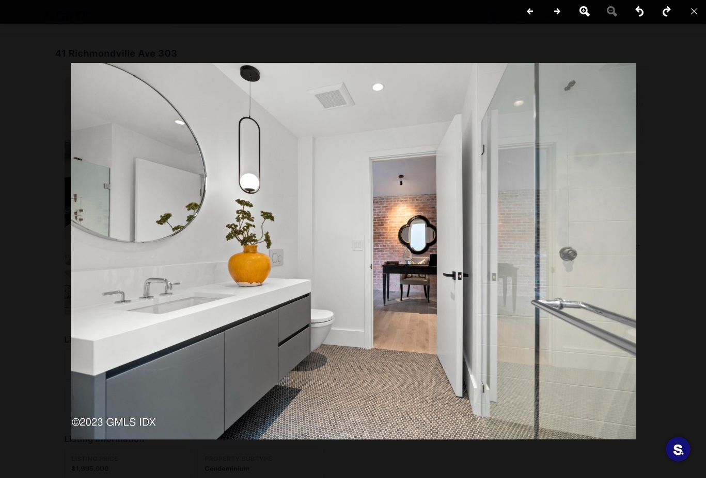

# Seeing More Info About the Listing

This guide focuses on how to access the Listing Item Page, view detailed listing information, and interact with listing
images and descriptions on your web application.

## 2.1. Accessing the Listing Item Page

To access the detailed information about a listing, follow these steps:

- Begin by logging in to your user account on the web application.

- Navigate to the Main Page or the page where listings are displayed (it could be Profile listings subpage or Add
  Listings modal).

- Locate the listing you are interested in. Listings are typically displayed as cards.

- Click on the title, image, or a designated area of the listing to access the Listing Item Page.

## 2.2. Viewing Detailed Listing Information

Once you are on the Listing Item Page, you will find comprehensive information about the selected listing. Here's what
you can typically expect:

- **Listing Address:** The title of the listing is prominently displayed at the top of the page.

- **Listing Images:** Multiple images of the listing are provided, allowing you to see the property or item from
  different angles.

Also, you can click on Eye icon button to open image watcher to see them more detailed.

- **Listing Description:** A detailed description of the listing provides information about its features,
  specifications, and any additional details the seller has provided.

- **Price:** The price of the listing is displayed.

- **Location:** Information about the location of the listing, such as the region or address.

- **Listing information:** Amount of rooms, baths, bedrooms etc.

## 2.3. Interacting with Listing Images and Descriptions

When viewing detailed listing information, you can interact with the images and descriptions in various ways:

- **Image Gallery:** If there are multiple images, you can often navigate through them by clicking on arrows or
  thumbnails. This allows you to get a comprehensive view of the listing.

- **Zooming In:** You can often click on images to zoom in for a closer look, especially for items with intricate
  details.

By following these steps and utilizing the features provided on the Listing Item Page, you can access detailed
information about listings and make informed decisions regarding your interactions with the listings.