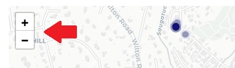
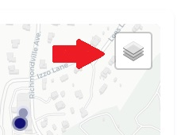
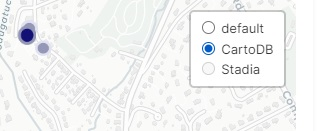
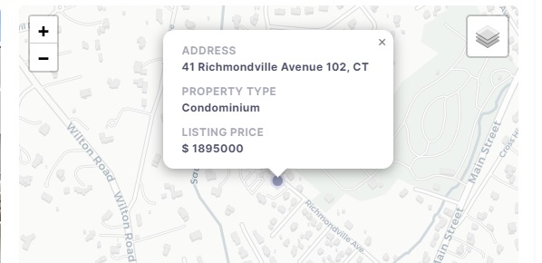

# Using the Map

This user guide explains how to effectively use the map on Serhant GPT. You'll learn how to navigate the map, zoom in
and out, switch between layers (appearance of the map), and interact with listing
markers.

## Table of Contents

1. **Map Navigation**
    - 1.1. Moving Across the Map
    - 1.2. Zooming In and Out

2. **Layer Selection**
    - 2.1. Switching Between Map Layers

3. **Interacting with Listing Markers**
    - 3.1. Hovering Over Markers for Basic Info
    - 3.2. Clicking on Markers for Detailed Info

## 1. Map Navigation

Navigating the map is essential for exploring different listings around. Here's how to do it:

### 1.1. Moving Across the Map

- To move across the map, click and hold your mouse cursor on the map.

- While holding the mouse button, drag the map in the desired direction.

- Release the mouse button to stop moving.

### 1.2. Zooming In and Out

- Use the scroll wheel on your mouse or the map controls (usually found in the bottom right corner) to zoom in and out.

- Alternatively, you can double-click on the map to zoom in, or use a two-finger pinch gesture on touch devices.

## 2. Layer Selection

The map offer three different layers. Here's how to switch between them:

### 2.1. Switching Between Map Layers

- Look for a `Layers` or `Map Type` control, located in the top right corner of the map.

- Hover this control to access a menu of available map layers.

- Select the desired layer, such as `Default` or `CartoDB` to change the map's appearance.

## 3. Interacting with Listing Markers

Listing markers on the map provide information about specific listings. Here's how to interact with them:

### 3.1. Hovering Over Markers for Basic Info

- As you move your mouse cursor over a marker (usually represented as a dot on the map), basic information about the
  listing will appear in a tooltip. This information often includes the full address.

### 3.2. Clicking on Markers for Detailed Info

- To access more detailed information about a listing, click on the marker.

- A popup will appear with additional details, which include the address, listing price, property type, and more.

- You can close the popup by clicking the "Close" or "X" button or just clicking away.

By following these instructions, you can effectively use the map.