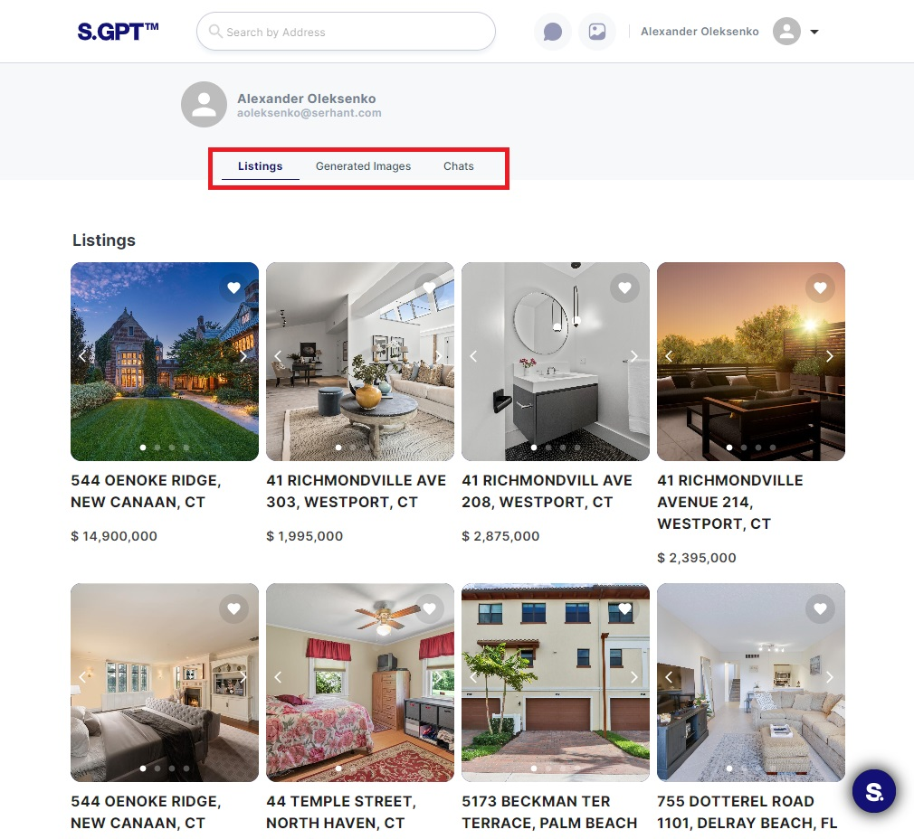
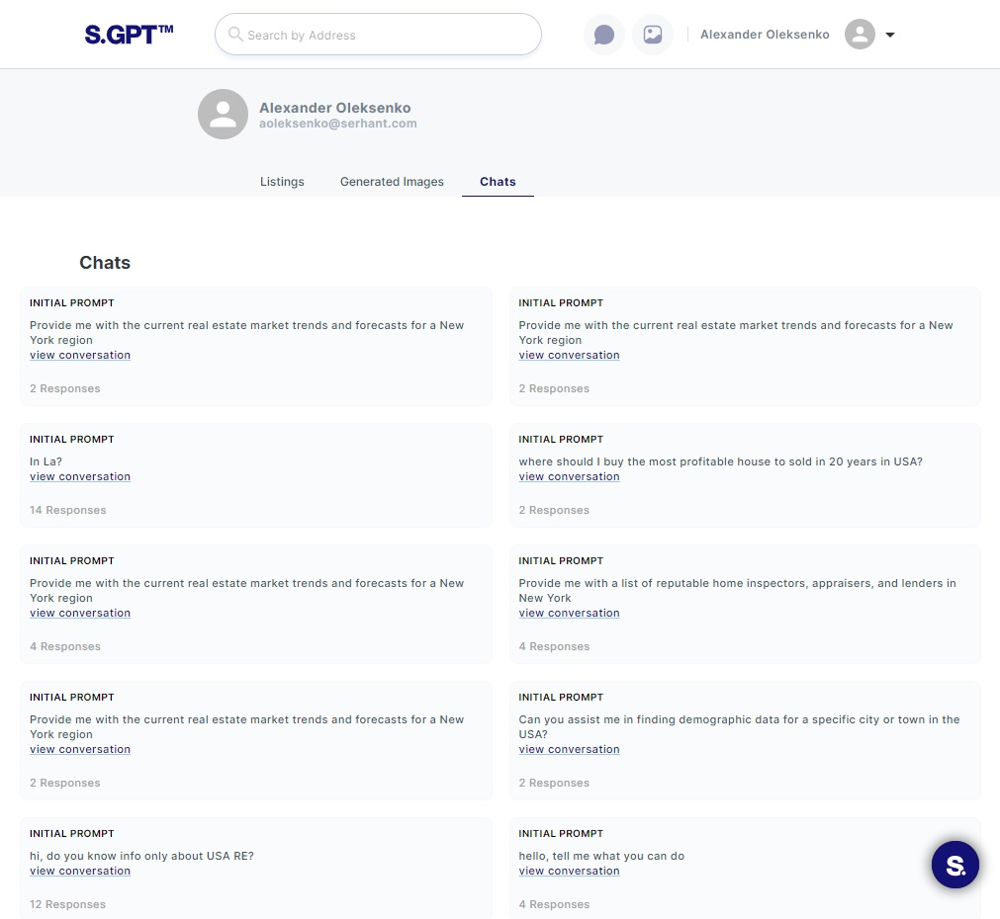

# Profile Page

The Profile Page on Serhant GPT is a hub for managing various aspects of your user account. This guide will
provide a detailed overview of the Profile Page, including its subpages and features.

## Table of Contents

1. **[Profile Page Overview](#1-profile-page-overview)**
    - 1.1. Header Information

2. **[Listings Subpage](#2-listings-subpage)**
    - 2.1. Viewing Liked Listings
    - 2.2. Navigating to Listing Item Page

3. **[Generated Images Subpage](#3-generated-images-subpage)**
    - 3.1. Viewing Generated Images

4. **[Chats Subpage](#4-chats-subpage)**
    - 4.1. Managing Chat Conversations
    - 4.2. Accessing Chat Details

## 1. Profile Page Overview

The Profile Page is a central location for managing your user account. It provides access to subpages that allow you to
view liked listings, generated images, and chat conversations.

### 1.1. Header Information

- At the top of the Profile Page, you'll find essential user information, including your avatar photo, name, and email
  address. This header remains consistent across all subpages for easy navigation.

## 2. Listings Subpage

The Listings Subpage allows you to manage listings you've liked and provides a gateway to view more details about these
listings.

### 2.1. Viewing Liked Listings

- On this subpage, you can see a list of listings that you've liked.

### 2.2. Navigating to Listing Item Page

- Clicking on the image of a listing will navigate you to the `Listing Item Page`, where you can access
  comprehensive information about the listing.

## 3. Generated Images Subpage

The Generated Images Subpage lets you access all the images you've generated through the Serhant GPT.

### 3.1. Viewing Generated Images

- Here, you can browse and review all the images you've created using the application's image generation feature.

- You can like some generated images to highlight them.
- Also, you can click on Eye icon button to see generated images more detail.

## 4. Chats Subpage

The Chats Subpage is where you can manage and access your chat conversations.

### 4.1. Managing Chat Conversations

- In this subpage, you'll see a list of your chat conversations with other users.

### 4.2. Accessing Chat Details

- Clicking the "View Conversation" button for a specific chat item will take you to the Chat Page, where you can review
  the entire chat and continue the conversation.

By following the instructions in this guide, you can efficiently navigate and utilize the Profile Page on your web
application, accessing and managing various aspects of your user account.